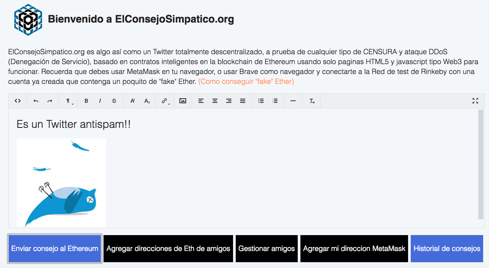
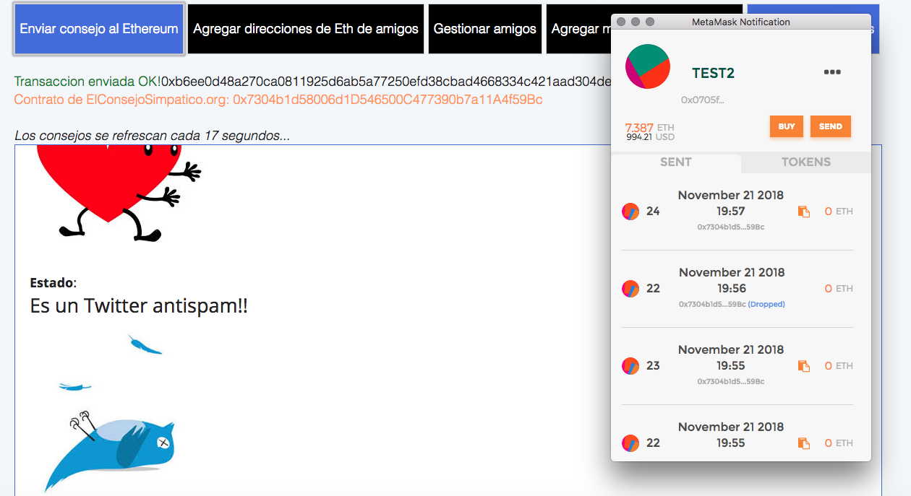
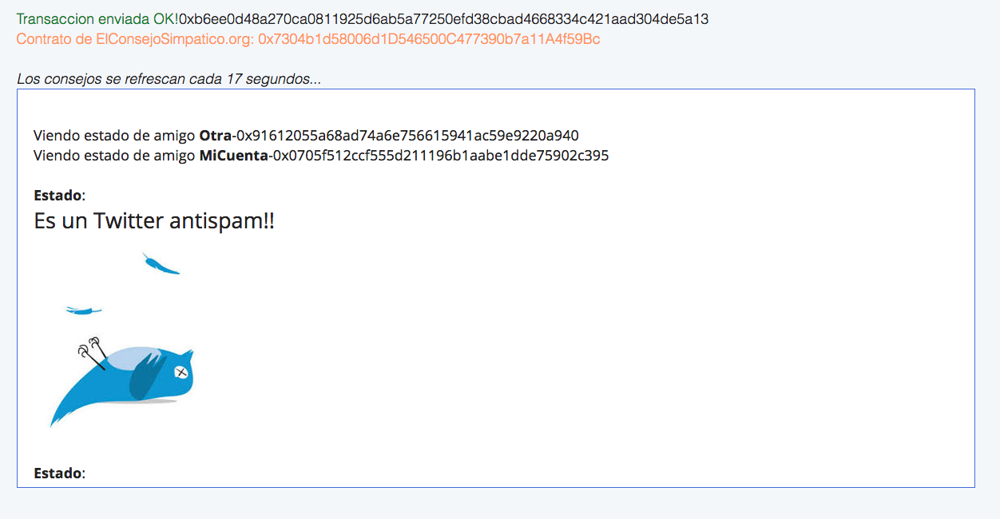

## Bienvenido a ElConsejoSimpatico

Try the following link;

[https://elconsejosimpatico.github.io/ElConsejoSimpatico/](https://elconsejosimpatico.github.io/ElConsejoSimpatico/)

ElConsejoSimpatico.org es algo así como un Twitter totalmente descentralizado, a prueba de cualquier tipo de CENSURA y ataque DDoS (Denegación de Servicio), basado en contratos inteligentes en la blockchain de Ethereum usando solo paginas HTML5 y javascript tipo Web3 para funcionar. Recuerda que debes usar MetaMask en tu navegador, o usar Brave como navegador y conectarte a la Red de test de Rinkeby con una cuenta ya creada que contenga un poquito de "fake" Ether.

### Haz un fork e instalalo donde quieras

Publicalo en cualquier webserver (dado que solo usa HTML5 y Javascript para funcionar).
Copiar y listo! Incluso lo puedes publicar como una Web de GitHub!

### Contacto y otros detalles

Creado por [MrAddon](http://mraddon.com) 2018 @Barcelona. Usando el plugin [Trumbowyg](https://alex-d.github.io/Trumbowyg/) para el campo de edición de Texto Enriquecido HTML WYSWYG.

### Algunas imagenes de la Dapp

Envia contenido enriquecido en forma de Consejo al Ethereum Rinkeby. (Para enviar el consejo se debe pagar un poco de "fake" Ether)

Lee los consejos de tus amigos. Esos consejos estan guardados en la blockchain de Ethereum Rinkeby

Un Twitter diferente y sin SPAM, ni anuncios, con un sistema anticensura de alta tecnología, donde lo importante es el Consejo Simpatico que vas a dar a la pequeña Isla llamada Mundo!

Por MrAddon :)
